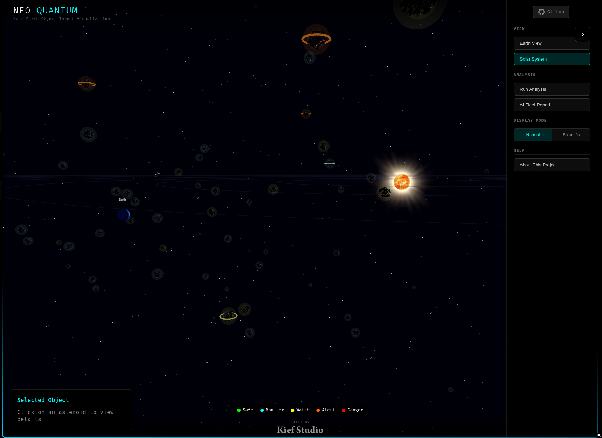
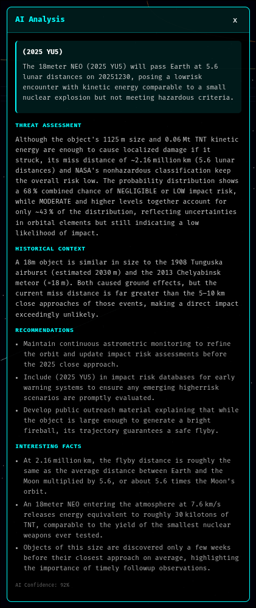
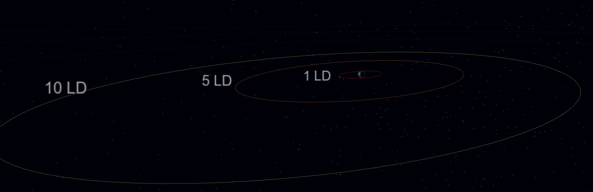
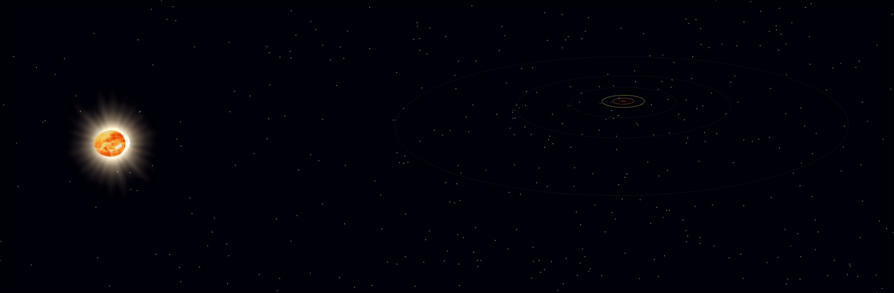
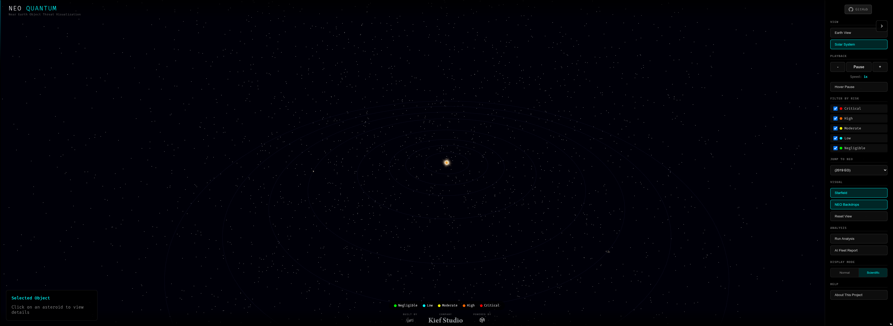

# NEO Quantum

**Real-time 3D visualization of Near Earth Objects with GPU-accelerated quantum circuit simulation**

[](https://developer.nvidia.com/cuda-quantum)
[](https://threejs.org/)
[](https://fastapi.tiangolo.com/)
[](https://www.gnu.org/licenses/agpl-3.0)



## Screenshots

### Solar System View

*Full solar system visualization with the Sun at center, orbiting planets, and NEOs color-coded by threat level. Control panel on the right provides view switching, playback controls, and risk filters.*

### AI Threat Analysis

*AI-generated threat assessment for individual asteroids, including historical context, impact energy calculations, recommendations, and interesting facts.*

### Distance Reference Rings

*Earth view showing lunar distance (LD) reference rings at 1, 5, and 10 LD. Helps visualize how close NEOs will pass to Earth.*

### Sun and Inner Solar System

*View of the Sun with realistic corona effect and the inner solar system. Shows Earth's position relative to the Sun.*

### Risk Filters and Controls

*Control drawer showing risk level filters (Critical, High, Moderate, Low, Negligible), NEO dropdown selector grouped by threat level, playback controls, and visual toggles.*

## What This Project Is

NEO Quantum is an **educational and research demonstration** that combines:

1. **Real NASA NEO Data** - Live asteroid data from NASA's Near Earth Object Web Service
2. **Interactive 3D Visualization** - Three.js-powered solar system view with real orbital mechanics
3. **Quantum Algorithm Demonstrations** - GPU-simulated quantum circuits using NVIDIA CUDA-Q

This project demonstrates how quantum computing algorithms *could* be applied to asteroid threat assessment. It is **not** an operational planetary defense system and should not be used for actual risk assessment.

## Important Disclaimers

### On Quantum Computing

This project uses **NVIDIA CUDA-Q to simulate quantum circuits on classical GPU hardware**. Key clarifications:

- **No Quantum Hardware**: All quantum circuits run on GPU-simulated qubits, not actual quantum processors
- **No Quantum Speedup**: On a classical simulator, quantum algorithms provide zero computational advantage over classical algorithms. We are demonstrating *what* these algorithms do, not gaining any speedup from them
- **Educational Purpose**: The quantum implementations show how VQC, VQE, QAE, and QAOA algorithms work and how they *could* be applied to this domain

### On Risk Assessment

- **Not Official**: Threat levels and collision probabilities are **illustrative demonstrations**, not official NASA risk assessments
- **Simplified Physics**: The orbital mechanics and risk calculations use simplified models for educational purposes
- **Do Not Rely On**: For actual asteroid impact risk, refer to [NASA's CNEOS](https://cneos.jpl.nasa.gov/) and the [ESA NEO Coordination Centre](https://neo.ssa.esa.int/)

## Architecture

```
NEO Quantum
├── ui/                     # Three.js Frontend (TypeScript)
│   ├── src/
│   │   ├── main.ts         # Application entry point
│   │   ├── scene/          # 3D scene components
│   │   │   ├── SceneManager.ts
│   │   │   ├── Earth.ts, Moon.ts, Sun.ts
│   │   │   ├── NEOObject.ts      # Asteroid visualization
│   │   │   └── Planets.ts        # Solar system planets
│   │   ├── ui/
│   │   │   └── DisplayMode.ts    # Normal/Scientific display
│   │   └── websocket/
│   │       └── NEODataStream.ts  # Real-time data connection
│   └── public/
│       └── textures/       # Planet textures
│
├── api/                    # FastAPI Backend (Python)
│   ├── server.py           # WebSocket server
│   ├── schemas.py          # Pydantic data models
│   ├── quantum_worker.py   # Async quantum execution
│   └── ai_analyst.py       # LLM-powered insights
│
└── src/                    # Quantum Modules (Python + CUDA-Q)
    ├── neo_fetcher.py              # NASA API client
    ├── quantum_risk_classifier.py  # VQC threat classification
    ├── orbital_simulator.py        # Orbital dynamics simulation
    ├── quantum_orbital_mechanics.py # Advanced quantum algorithms
    ├── quantum_engine.py           # Unified quantum engine
    └── training_data_fetcher.py    # NASA training data
```

## Quantum Algorithms Implemented

### 1. Variational Quantum Classifier (VQC)

**File:** `quantum_risk_classifier.py`, `quantum_engine.py`

A parameterized quantum circuit for classifying asteroid threat levels.

```
Circuit Structure:
├── Feature Encoding: RY rotations encode NEO properties
├── Variational Layers: RX, RY, RZ rotations with trainable parameters
├── Entanglement: CNOT gates in ring topology
└── Measurement: Probability distribution mapped to threat levels
```

**What it demonstrates:** How quantum machine learning could classify threats based on physical properties (size, velocity, distance, etc.)

**Limitations:**
- On a simulator, this is slower than classical ML (e.g., random forest)
- The threat level mapping is heuristic, not derived from physics
- Training on 4 qubits with ~36 parameters

### 2. Variational Quantum Eigensolver (VQE)

**File:** `quantum_engine.py`

Demonstrates VQE for analyzing orbital stability.

```
Circuit Structure:
├── Orbital Encoding: 4 parameters (a, e, i, Ω) encoded via RY gates
├── Ansatz: 6-qubit variational circuit with entanglement
├── Optimizer: Classical COBYLA minimizes energy expectation
└── Output: "Stability score" from ground state energy
```

**What it demonstrates:** How VQE's variational optimization could find stable orbital configurations

**Limitations:**
- The "Hamiltonian" is a simplified heuristic, not derived from celestial mechanics
- "Ground state energy" is a proxy metric, not a physical observable
- Proof-of-concept only

### 3. Quantum Amplitude Estimation (QAE)

**File:** `quantum_engine.py`

Demonstrates QAE for collision probability estimation.

```
Circuit Structure:
├── State Preparation: Encode trajectory uncertainty
├── Grover Operator: Mark collision states
├── Phase Estimation: 4 precision qubits
├── Inverse QFT: Extract probability amplitude
└── Output: Collision probability with confidence interval
```

**What it demonstrates:** How QAE could provide quadratic speedup for Monte Carlo probability estimation

**Limitations:**
- **No actual speedup on simulator** - we're simulating what would happen on quantum hardware
- The collision oracle is simplified
- On real quantum hardware, this would require error correction

### 4. Quantum Approximate Optimization Algorithm (QAOA)

**File:** `quantum_orbital_mechanics.py`, `quantum_engine.py`

Demonstrates QAOA for deflection trajectory optimization.

```
Circuit Structure:
├── Initial State: Equal superposition over delta-V configurations
├── Cost Layer: Encodes deflection effectiveness
├── Mixer Layer: RX rotations for state exploration
├── Layers: Configurable depth (default: 3-4)
└── Output: Optimal deflection vector (direction + magnitude)
```

**What it demonstrates:** How QAOA could optimize mission parameters for asteroid deflection

**Limitations:**
- Cost Hamiltonian is heuristic, not rigorous astrodynamics
- Real mission planning requires precise orbital propagation
- Educational demonstration only

### 5. Quantum Hamiltonian Simulation

**File:** `orbital_simulator.py`, `quantum_orbital_mechanics.py`

Demonstrates Trotterized time evolution for N-body gravitational dynamics.

**What it demonstrates:** How quantum computers could simulate gravitational interactions

**Limitations:**
- Highly simplified model (not full N-body physics)
- Would require many more qubits for realistic simulation

## Data Sources

All asteroid data comes from official NASA APIs:

| Source | API | Data |
|--------|-----|------|
| [NeoWs](https://api.nasa.gov/) | Near Earth Object Web Service | Current NEO positions, velocities, sizes |
| [Sentry](https://ssd-api.jpl.nasa.gov/doc/sentry.html) | Impact Risk API | Objects with computed impact probability |
| [SBDB](https://ssd-api.jpl.nasa.gov/doc/sbdb.html) | Small-Body Database | Orbital elements, physical properties |
| [CAD](https://ssd-api.jpl.nasa.gov/doc/cad.html) | Close Approach Data | Historic and future close approaches |

## Installation

### Prerequisites

- Python 3.11+
- Node.js 18+
- NVIDIA GPU with CUDA support (for GPU acceleration)
- [NVIDIA CUDA-Q](https://developer.nvidia.com/cuda-quantum) installed

### Backend Setup

```bash
# Clone the repository
git clone https://github.com/HxHippy/neo-quantum.git
cd neo-quantum

# Create virtual environment
python -m venv venv
source venv/bin/activate  # Linux/Mac
# or: venv\Scripts\activate  # Windows

# Install dependencies
pip install -r requirements.txt

# Set up environment variables
cp .env.example .env
# Edit .env with your NASA API key (get one at https://api.nasa.gov/)
```

### Frontend Setup

```bash
cd ui
npm install
```

### Running

```bash
# Terminal 1: Start backend
cd neo_quantum
source ../venv/bin/activate
uvicorn api.server:app --reload --port 8000

# Terminal 2: Start frontend
cd ui
npm run dev
```

Open http://localhost:3000 in your browser.

## Configuration

Copy `.env.example` to `.env` and configure your API keys:

```bash
cp .env.example .env
nano .env  # Add your API keys
```

### Quick Configuration

```bash
# Required
NASA_API_KEY=your_nasa_api_key_here  # Get free at https://api.nasa.gov/

# Optional (enables AI Fleet Reports)
OPENROUTER_API_KEY=your_openrouter_key

# Server
API_HOST=0.0.0.0
API_PORT=8000
```

### Quantum Circuit Tuning

```bash
# Adjust circuit complexity (affects accuracy vs speed)
QUANTUM_NUM_QUBITS=4          # 4-8 qubits
QUANTUM_NUM_LAYERS=3          # 2-5 layers
QUANTUM_DEFAULT_SHOTS=1000    # 200-5000 shots
```

### Full Configuration Reference

See **[docs/CONFIGURATION.md](docs/CONFIGURATION.md)** for:
- All 50+ configuration options
- Environment profiles (development, production, high-performance)
- Troubleshooting guide
- Security best practices

## WebSocket API

Connect to `ws://localhost:8000/ws/neo-stream` for real-time data.

### Client Messages

```javascript
// Start analysis
{ "type": "start_analysis", "data": { "days_ahead": 7 } }

// Request AI fleet analysis
{ "type": "request_fleet_analysis" }

// Request quantum state visualization
{ "type": "request_quantum_state", "data": { "neo_id": "..." } }

// Train VQC on NASA data
{ "type": "request_train_vqc", "data": { "use_nasa_data": true, "epochs": 50 } }
```

### Server Messages

```javascript
// NEO list received
{ "type": "neo_list", "data": { "neos": [...] } }

// Risk classification update
{ "type": "risk_update", "data": { "neo_id": "...", "threat_level": "LOW", ... } }

// Quantum state data
{ "type": "quantum_state", "data": { "num_qubits": 4, "entropy": 0.85, ... } }
```

## Training the Classifier

The VQC can be trained on real NASA data:

```python
from quantum_engine import create_quantum_engine

engine = create_quantum_engine()

# Train on NASA Sentry + historic data
result = engine.train_on_nasa_data(
    epochs=50,
    learning_rate=0.1,
    shots=500,
    test_split=0.2
)

print(f"Test accuracy: {result['test_accuracy']:.1%}")
```

Training data includes:
- NASA Sentry objects (computed impact probabilities)
- Historic close approaches (1900-present)
- Known impact events (Chelyabinsk, Tunguska, etc.)
- Future PHA approaches

## Performance

Tested on NVIDIA RTX 3080 Ti:

| Operation | Time | Notes |
|-----------|------|-------|
| Batch classify 50 NEOs | ~3s | 500 shots per NEO |
| VQE stability analysis | ~5s | 30 optimization iterations |
| QAE collision probability | ~2s | 4000 shots |
| QAOA deflection | ~8s | 4 layers, COBYLA optimization |

## Project Structure Deep Dive

### Frontend (`ui/`)

- **Three.js Scene**: Realistic solar system with Earth, Moon, Sun, and planets
- **NEO Visualization**: Asteroids colored by threat level with orbital paths
- **Dual Display Modes**: "Normal" (public-friendly) and "Scientific" (expert) views
- **Real-time Updates**: WebSocket connection streams quantum analysis results

### Backend (`api/`)

- **FastAPI + WebSocket**: Async streaming of analysis results
- **Thread Pool Execution**: Quantum circuits run in separate threads
- **Caching**: NEO data and analysis results cached for performance

### Quantum Modules (`src/`)

- **CUDA-Q Integration**: All quantum circuits use NVIDIA's CUDA-Q SDK
- **GPU Acceleration**: Simulations run on NVIDIA GPUs when available
- **Modular Design**: Each quantum algorithm is self-contained

## Extending This Project

### Adding New Quantum Algorithms

1. Define your kernel in `quantum_engine.py`:
```python
@cudaq.kernel
def my_algorithm(params: list[float]):
    qubits = cudaq.qvector(4)
    # Your circuit here
    mz(qubits)
```

2. Add a method to `QuantumNEOEngine`:
```python
def run_my_algorithm(self, neo_data, shots=1000):
    result = cudaq.sample(my_algorithm, params, shots_count=shots)
    return self._process_result(result)
```

3. Expose via WebSocket in `server.py`

### Adding New Data Sources

Extend `training_data_fetcher.py` to pull from additional APIs (ESA, etc.)

## Contributing

Contributions welcome! Areas of interest:

- **Quantum Algorithms**: More sophisticated VQE Hamiltonians, error mitigation
- **Visualization**: Improved orbital mechanics, trajectory prediction
- **Data Sources**: Integration with ESA, other space agency APIs
- **Documentation**: Tutorials, educational content

## References

### Quantum Computing
- [NVIDIA CUDA-Q Documentation](https://nvidia.github.io/cuda-quantum/latest/)
- [Variational Quantum Eigensolver](https://arxiv.org/abs/1304.3061)
- [Quantum Approximate Optimization Algorithm](https://arxiv.org/abs/1411.4028)
- [Quantum Amplitude Estimation](https://arxiv.org/abs/quant-ph/0005055)

### Planetary Defense
- [NASA Planetary Defense Coordination Office](https://www.nasa.gov/planetarydefense)
- [NASA CNEOS](https://cneos.jpl.nasa.gov/)
- [ESA Planetary Defence](https://www.esa.int/Space_Safety/Planetary_Defence)
- [Sentry Impact Risk Assessment](https://cneos.jpl.nasa.gov/sentry/)

### Orbital Mechanics
- Vallado, D. A. "Fundamentals of Astrodynamics and Applications"
- [JPL Small-Body Database](https://ssd.jpl.nasa.gov/tools/sbdb_lookup.html)

## License

AGPL-3.0 License - see [LICENSE](LICENSE)

This project requires attribution to Kief Studio and HxHippy. If you modify and deploy this software (including as a network service), you must make your source code available.

## Credits

Built by [HxHippy](https://hxhippy.com) | CTO of [Kief Studio](https://kief.studio) | Powered by [LTFI](https://ltfi.ai)

Data provided by [NASA](https://api.nasa.gov/)

Quantum simulation powered by [NVIDIA CUDA-Q](https://developer.nvidia.com/cuda-quantum)

---

**Remember**: This is an educational demonstration. For real asteroid impact risk assessment, always refer to official sources like [NASA CNEOS](https://cneos.jpl.nasa.gov/) and [ESA NEOCC](https://neo.ssa.esa.int/).
